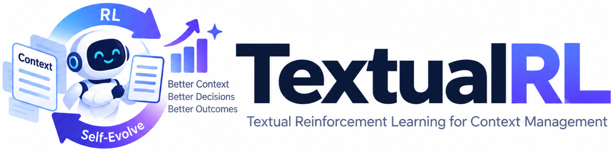
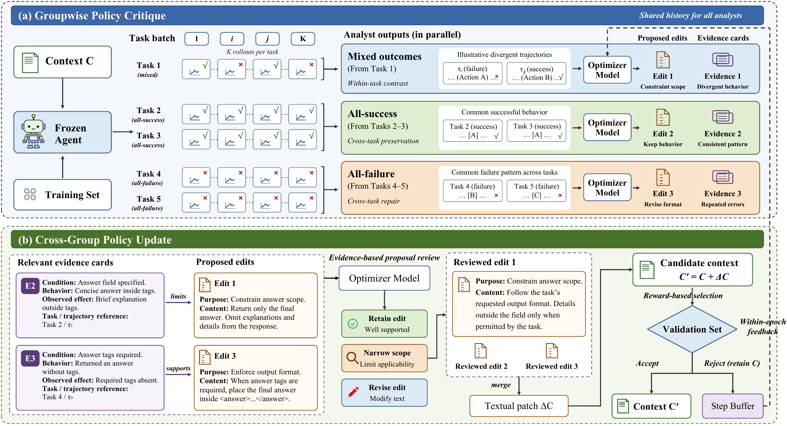

<p align="center">
  
</p>

TextualRL improves an agent's shared textual instructions while keeping the target model's weights fixed. It collects multiple rollouts for each training task, critiques outcome groups, reviews proposed edits against pooled trajectory evidence, and selects candidate contexts using held-out validation rewards.

## Framework

[](docs/assets/textualrl-framework.pdf)

**Groupwise Policy Critique** keeps same-task rollout groups together. Mixed outcomes support within-task contrast, all-success groups support cross-task preservation, and all-failure groups support cross-task repair. Critics return edit proposals and evidence cards separately, including evidence with no proposed edit.

**Cross-Group Policy Update** consolidates proposals, reviews their scope against current-step evidence, and applies a bounded patch. The ordinary step accepts a candidate only when its configured held-out validation score improves. Within-epoch feedback informs subsequent critique calls.

## Install

Use Python 3.10 or newer from the repository directory:

```bash
python -m venv .venv
source .venv/bin/activate
python -m pip install --upgrade pip
python -m pip install -e .
```

Install the extra needed by your benchmark, for example:

```bash
python -m pip install -e '.[searchqa]'
python -m pip install -e '.[spreadsheetbench]'
python -m pip install -e '.[alfworld]'
```

See [installation](docs/installation.md) for all six benchmarks. Prepare datasets using the [data guide](docs/data.md).

## Inspect, train, and evaluate

First inspect the resolved configuration. Dry-run does not make model calls or require API credentials or benchmark data:

```bash
python -m textualrl train \
  --config configs/searchqa.yaml \
  --data-dir ./data \
  --output-dir ./outputs/searchqa/run1 \
  --dry-run
```

Copy `.env.example` to `.env`, replace its placeholders with your two endpoints and credentials, and export them:

```bash
cp .env.example .env
# Edit .env before sourcing it.
set -a
source .env
set +a
```

The default target is `Qwen3.8-27B` with thinking explicitly disabled. The default optimizer is `gpt-5.5` with medium reasoning. The endpoint must expose the API and model name configured for its role; model names may need to match your provider's deployment names.

```bash
python -m textualrl train \
  --config configs/searchqa.yaml \
  --data-dir ./data \
  --output-dir ./outputs/searchqa/run1

python -m textualrl eval \
  --config configs/searchqa.yaml \
  --data-dir ./data \
  --output-dir ./outputs/searchqa/eval-best \
  --skill ./outputs/searchqa/run1/best_skill.md \
  --split test
```

Evaluation uses the target model; training also requires the optimizer. To resume an interrupted run, supply the same configuration, data, and run directory:

```bash
python -m textualrl train \
  --config configs/searchqa.yaml \
  --data-dir ./data \
  --resume-from ./outputs/searchqa/run1
```

See [running experiments](docs/running.md) for configuration controls, checkpoint selection, and artifacts. A normal run can make many model calls: four rollouts for each of 40 tasks already produce 160 training trajectories per full batch, before critique and validation.

## Documentation

- [Installation and optional dependencies](docs/installation.md)
- [Datasets and split layout](docs/data.md)
- [Configuration and endpoint controls](docs/configuration.md)
- [Training, evaluation, resume, and saved artifacts](docs/running.md)
- [Method-to-code map](docs/method.md)

## Offline checks

```bash
python -m pip install -e '.[dev]'
python -m pytest -q
python -m build
```

The tests cover outcome routing, evidence review, edit checks, context overflow
splitting, generation settings, checkpoint behavior, and split preparation. An
end-to-end smoke test runs the trainer, completed-run resume, and evaluator
against a local HTTP fixture using synthetic tasks. These checks use no paid
model service. They do not measure benchmark accuracy.

## License and acknowledgements

We thank the authors of [SkillOpt](https://github.com/microsoft/SkillOpt) for releasing their code, which our implementation builds on.

The [MIT license](LICENSE) and Microsoft copyright notice are preserved. Bundled ALFWorld environment helpers carry Apache-2.0 attribution, with the corresponding license and notices included in [THIRD_PARTY_NOTICES.md](THIRD_PARTY_NOTICES.md). Benchmark data and separately installed dependencies retain their own terms.
